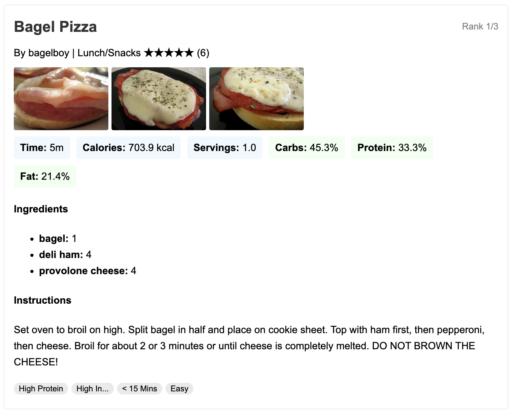
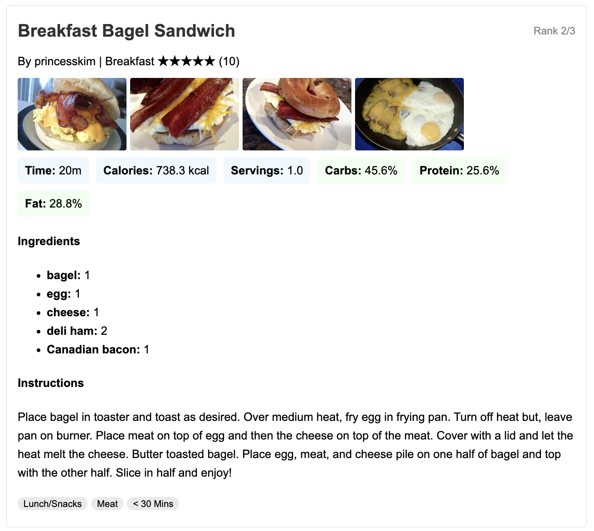
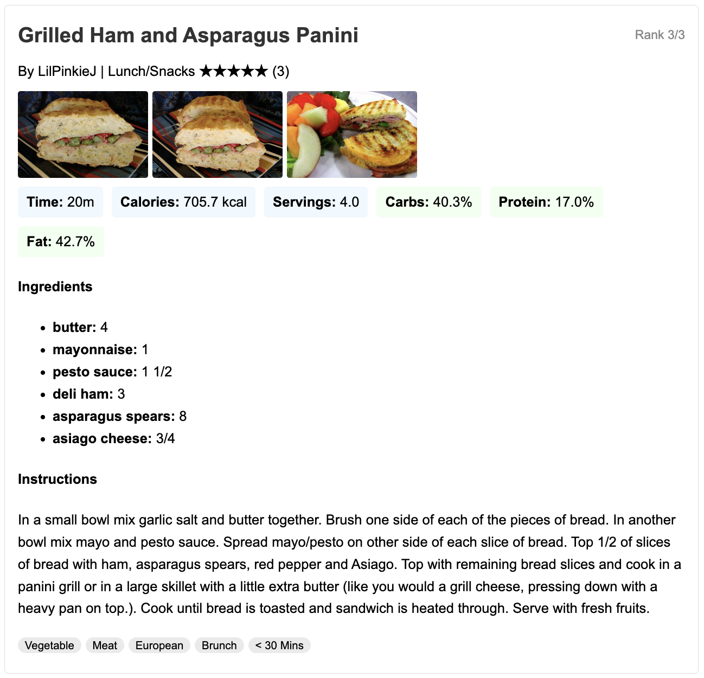
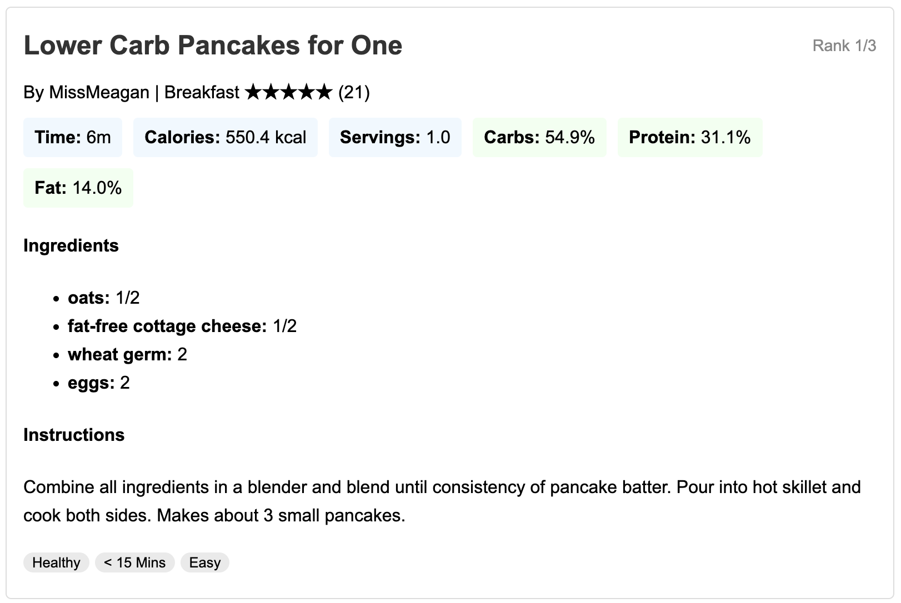
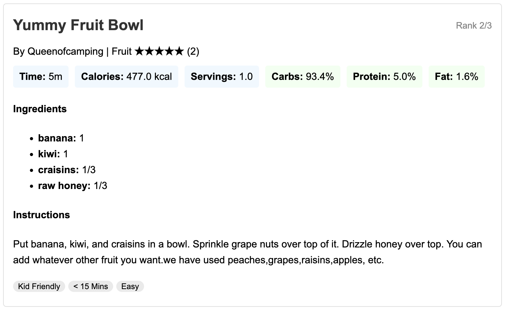
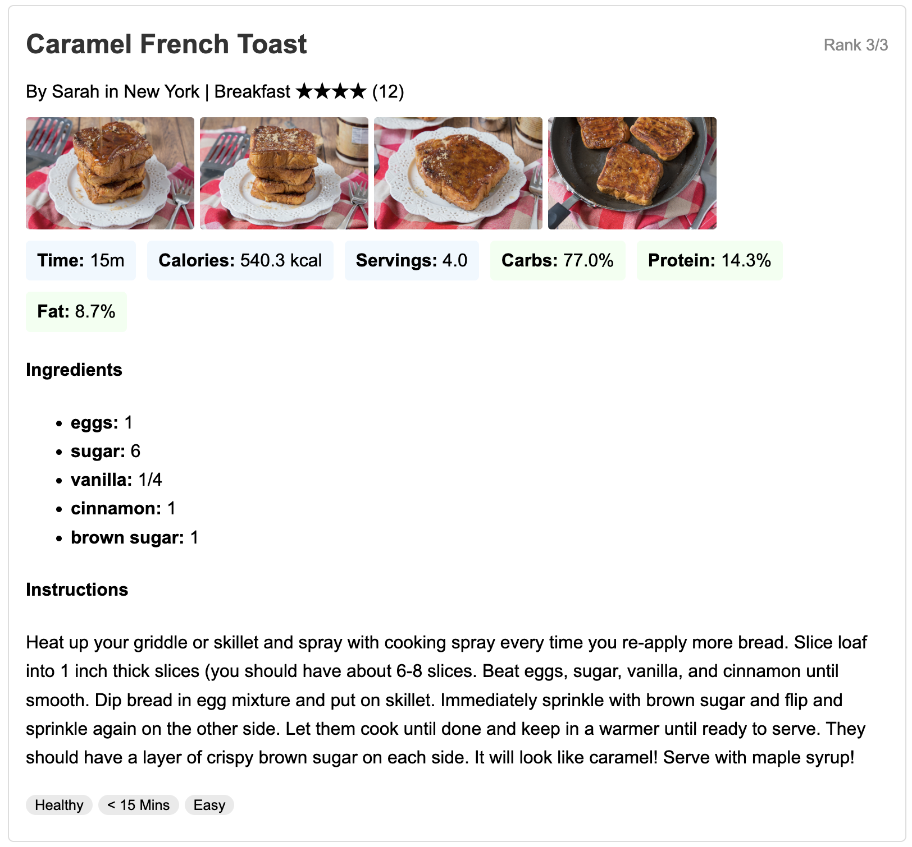
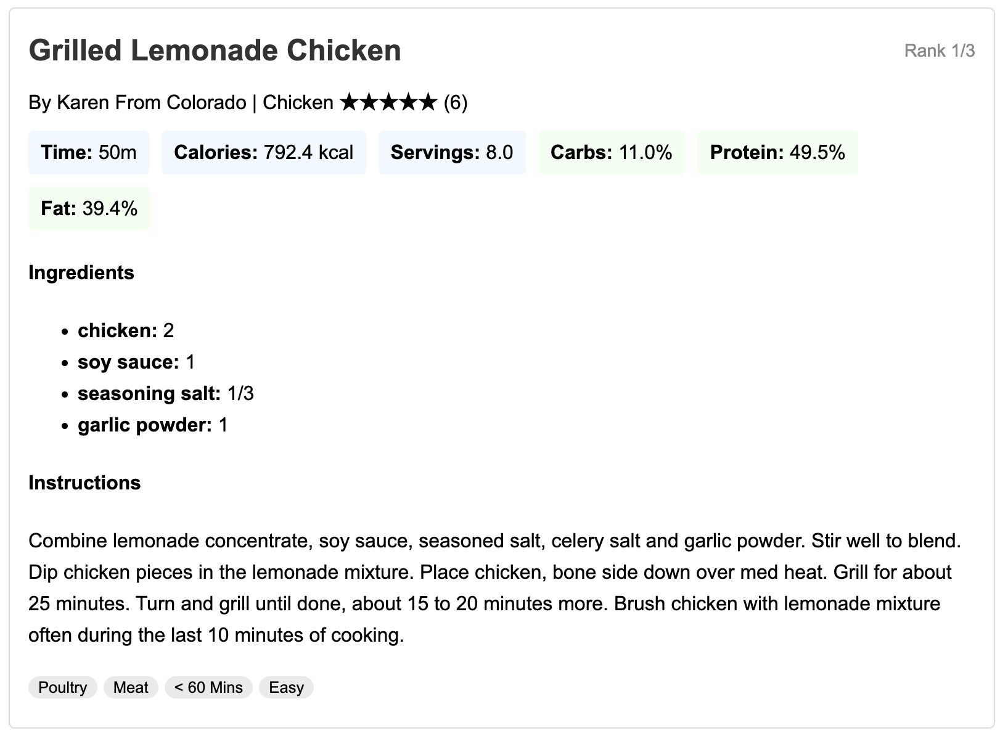
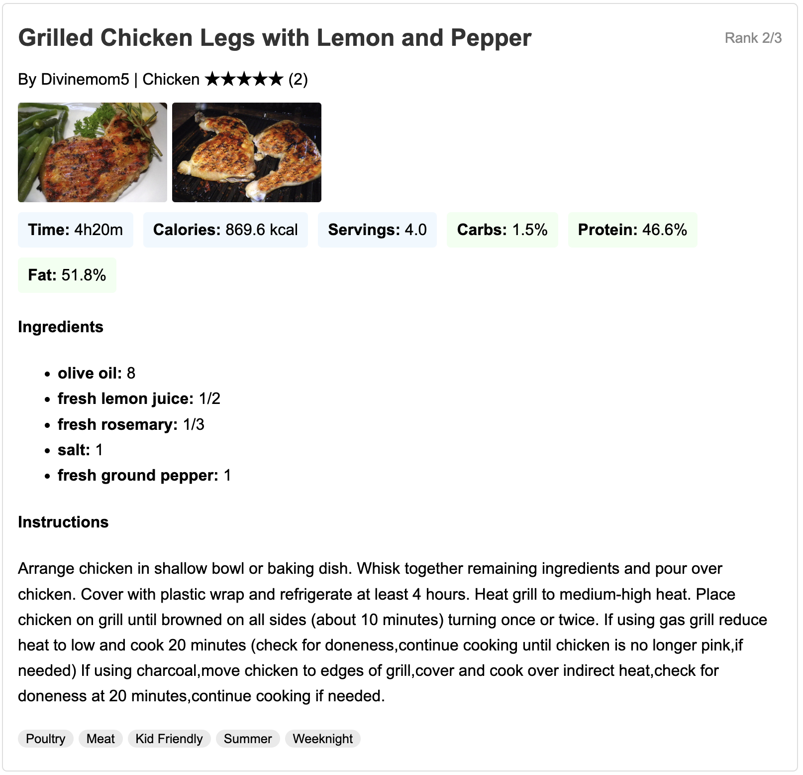
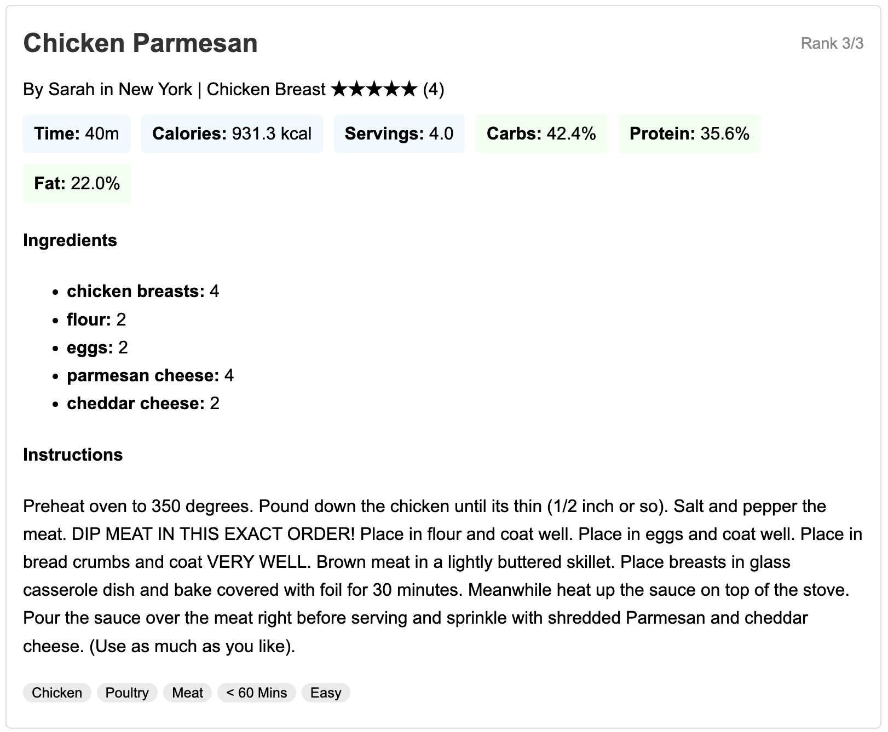

# 🧠 CraveControl Agent - Recipe Showcase Examples

This file contains three sample interactions with the CraveControl agent.  
Each section includes the **user input** and the **top 3 recipe suggestions** displayed by the system.

---

## 🍽️ Example 1

**User Input:**  
*"I'm daniel 33 years old, weight 50 kg, and I'm 170cm tall.I'm female and I work out 6 times a week.I want a heavy dinner with bagel with bacon, egg and cheese.I have ham and bagel and tomato in my fridge"*

**Suggested Recipes:**

1. 
2. 
3. 

---

## 🍽️ Example 2

**User Input:**  
*Add your second user query here...*

**Suggested Recipes:**

1. 
2. 
3. 

---

## 🍽️ Example 3

**User Input:**  
*Add your third user query here...*

**Suggested Recipes:**

1. 
2. 
3. 

---

📝 *To update this file, simply drag your PNG images into the `examples` folder, rename them to match the placeholders (or adjust the paths above), and edit the user input text as needed.*
